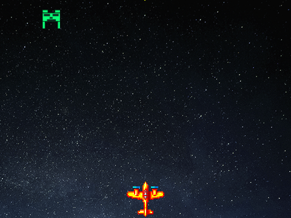

# Projeto Scratch – Jogo Avião

## Descrição
Um jogo desenvolvido no Scratch onde o jogador controla uma nave que deve acertar um alienígena verde em movimento. Cada acerto concede 1 ponto.

---

## Como Jogar

### 1. Início do Jogo
- A nave estará posicionada na parte inferior da tela, pronta para ser movimentada.
- O alienígena verde estará na parte superior, movendo-se continuamente da esquerda para a direita.

### 2. Movimentar a Nave
- Use as teclas para movimentar a nave horizontalmente:
  - **Seta para a esquerda**: move a nave para a esquerda.
  - **Seta para a direita**: move a nave para a direita.

### 3. Atirar
- **Pressione a tecla `espaço`** para disparar um tiro.
- O tiro sairá da nave e seguirá em linha reta para cima.

### 4. Acertar o Alienígena
- Mire nos movimentos do alienígena para acertá-lo.
- Quando o tiro tocar o alienígena:
  - Ele será eliminado e reaparecerá em outra posição.
  - Você ganhará **1 ponto**.

---

## Requisitos
- Scratch 3.0 ou superior.

---

## Contribuição
Sinta-se à vontade para abrir **issues** ou enviar **pull requests** para melhorar o jogo!

---

## Licença
Este projeto está licenciado sob a [MIT License](LICENSE).

## Projeto scratch
https://scratch.mit.edu/projects/1104803422/
